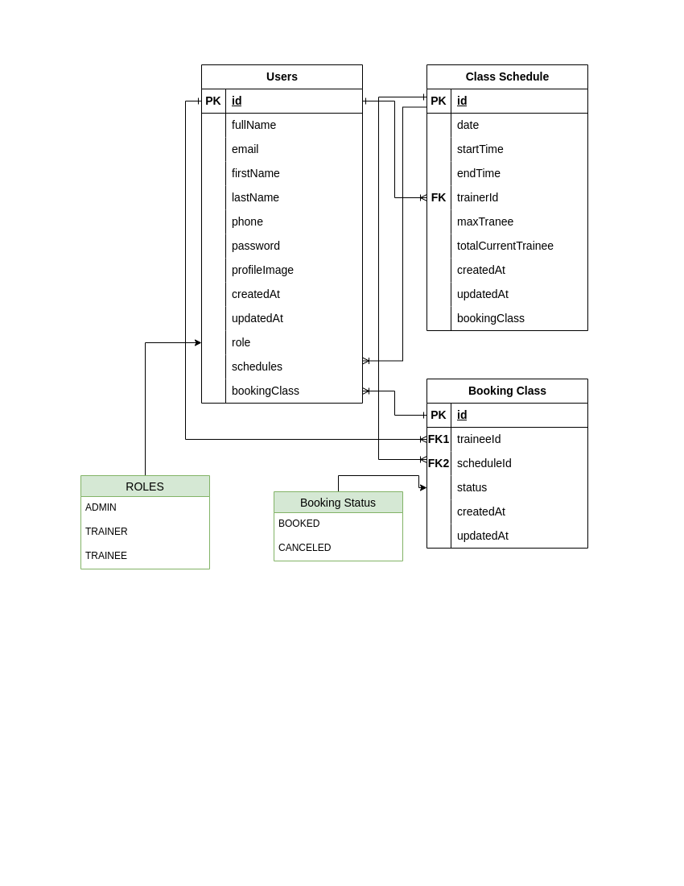

# Gym Class Scheduling and Membership Management System

## Project Overview

The Gym Class Scheduling and Membership Management System helps manage gym operations efficiently. It supports three roles: **Admin**, **Trainer**, and **Trainee**. Admins can create and manage trainers, schedule classes, and assign trainers to schedules. Trainers can view their assigned classes, while trainees can book available class schedules.

## Relation Diagram


(Add your relational diagram here or link to the hosted image.)

## Technology Stack

- **Programming Language:** TypeScript
- **Web Framework:** Express.js
- **ORM/ODM:** Prisma
- **Database:** PostgreSQL
- **Authentication:** JSON Web Tokens (JWT)

## API Endpoints

### Authentication

1. **Login**

   - `POST /api/auth/login`
   - **Parameters:** `{ email, password }`
   - **Response:** `{ success, token }`

2. **Register**
   - `POST /api/auth/register`
   - **Parameters:** `{ name, email, password, role }`
   - **Response:** `{ success, message }`

### Admin Endpoints

1. **Create Trainer**

   - `POST /api/admin/trainers`
   - **Parameters:** `{ name, email, expertise }`
   - **Response:** `{ success, trainer }`

2. **Schedule Class**
   - `POST /api/admin/schedules`
   - **Parameters:** `{ date, startTime, endTime, trainerId }`
   - **Response:** `{ success, schedule }`

### Trainer Endpoints

1. **View Assigned Classes**
   - `GET /api/trainers/schedules`
   - **Response:** `{ success, schedules }`

### Trainee Endpoints

1. **Book Class**

   - `POST /api/trainees/book`
   - **Parameters:** `{ scheduleId }`
   - **Response:** `{ success, booking }`

2. **Cancel Booking**
   - `DELETE /api/trainees/bookings/:id`
   - **Response:** `{ success, message }`

## Database Schema

### User Model

```json
{
  "id": "UUID",
  "name": "string",
  "email": "string",
  "firstName": "string",
  "lastName": "string",
  "fullName": "string",
  "password": "string",
  "phone": "string",
  "role": "ADMIN | TRAINER | TRAINEE",
  "createdAt": "Date",
  "updatedAt": "Date",
  "schedules": "array<string>",
  "bookingClass": "array<string>"
}
```

### Schedule Model

```json
{
  "id": "UUID",
  "date": "ISO 8601",
  "startTime": "ISO 8601",
  "endTime": "ISO 8601",
  "trainerId": "UUID",
  "trainees": ["UUID"],
  "maxTrainee": "number",
  "totalCurrentTrainee": "number",
  "createdAt": "Date",
  "updatedAt": "Date",
  "bookingClass": "array<string>"
}
```

### Booking Model

```json
{
  "id": "UUID",
  "scheduleId": "UUID",
  "traineeId": "UUID",
  "status": "Booked | Canceled",
  "createdAt": "Date",
  "updatedAt": "Date"
}
```

## Credentials

### Admin

- **Email:** admin@gmail.com
- **Password:** admin123

### Trainer

- **Email:** trainer@gmail.com
- **Password:** trainer123

### Trainee

- **Email:** trainee@gmail.com
- **Password:** trainee123

## Instructions to Run Locally

1. Clone the repository:
   ```bash
   git clone <https://github.com/AbuBokorprog/gym-management>
   cd gym-management
   ```
2. Install dependencies:
   ```bash
   yarn install
   ```
3. Configure environment variables:
   - Create a `.env` file with the following:
     `env
DATABASE_URL="<your_database_url>"
DIRECT_URL="<your_direct_database_url>"
PORT=5000
SALT=12
ACCESS_TOKEN=<your_access_token>
EXPIRES_IN=10d
REFRESH_TOKEN=<your_refresh_token>
REFRESH_EXPIRES_IN=365d
NODE_ENV=development
  `
4. Run Migrations:
   ```bash
   npx prisma migrate dev
   ```
5. Start the server:
   ```bash
   yarn run dev
   ```
6. Access the server at `http://localhost:5000`

## Live Hosting Link

[Gym Management System](https://gym-management-xi-flax.vercel.app/)

## Testing Instructions

### 1. **Users API**

- **Create Admin/Trainer/Trainee**
  - Endpoint: `POST api/users/create-admin`
  - Payload:
    ```json
    {
      "firstName": "MR.",
      "lastName": "User",
      "email": "user@gmail.com.com",
      "password": "user123"
    }
    ```
  - Expected Response:
    - **201 Created**: Admin user created successfully.
    - **400 Bad Request**: Validation errors.
- **Create Trainer**
  - Endpoint: `POST api/users/create-trainer`
  - Requires: `Authorization` header with an admin token.
  - Payload: Same as "Create Admin."
  - Expected Response: Same as "Create Admin."
  - **Create Trainee**
  - Endpoint: `POST api/users/create-trainee`
  - Requires: `Authorization` header with an admin token.
  - Payload: Same as "Create Admin."
  - Expected Response: Same as "Create Admin."
- **My Profile**
  - Endpoint: `GET api/users/my-profile`
  - Requires: `Authorization` header with a valid token.
  - Expected Response: User profile details.

### 2. **Class Schedule API**

- **Create Class Schedule**
  - Endpoint: `POST api/class-schedule/`
  - Requires: `Authorization` header with an admin token.
  - Payload:
    ```json
    {
      "date": "2025-01-10T00:00:00Z",
      "startTime": "2025-01-10T06:00:00Z",
      "endTime": "2025-01-10T08:00:00Z",
      "trainerId": "da3602d6-7e48-476c-938e-b5d0dd37cf67"
    }
    ```
  - Expected Response:
    - **201 Created**: Schedule created successfully.
    - **400 Bad Request**: Time overlaps or validation errors.
- **Retrieve All Schedules**
  - Endpoint: `GET /class-schedule/`
  - Expected Response: Retrieve all class schedules successfully!

### 3. **Booking Schedule API**

- **Create Booking**
  - Endpoint: `POST /booking-schedule/`
  - Requires: `Authorization` header with a trainee token.
  - Payload:
    ```json
    {
      "scheduleId": "278ff3f2-eb81-4c3d-a572-63d34d3e100a"
    }
    ```
  - Expected Response:
    - **201 Created**: Class booked successfully!
    - **400 Bad Request**: Class schedule not found, You're already booked this class schedule, Class schedule is full. Maximum 10 trainees allowed per schedule, You have already booked another class in the same time slot, or validation errors.
- **Retrieve My Bookings**
  - Endpoint: `GET /booking-schedule/my-booking-schedules`
  - Requires: `Authorization` header with a trainee token.
  - Expected Response: List of bookings for the trainee.

### 4. **Authentication**

- **Login**
  - Endpoint: `POST /auth/login`
  - Payload:
    ```json
    {
      "email": "user@example.com",
      "password": "password"
    }
    ```
  - Expected Response:
    - **200 OK**: Returns an access token.
    - **401 Unauthorized**: Invalid credentials.
